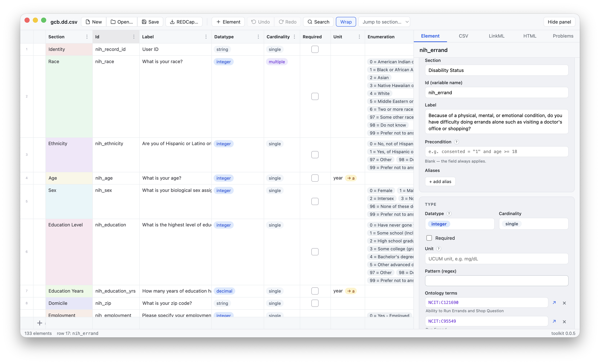
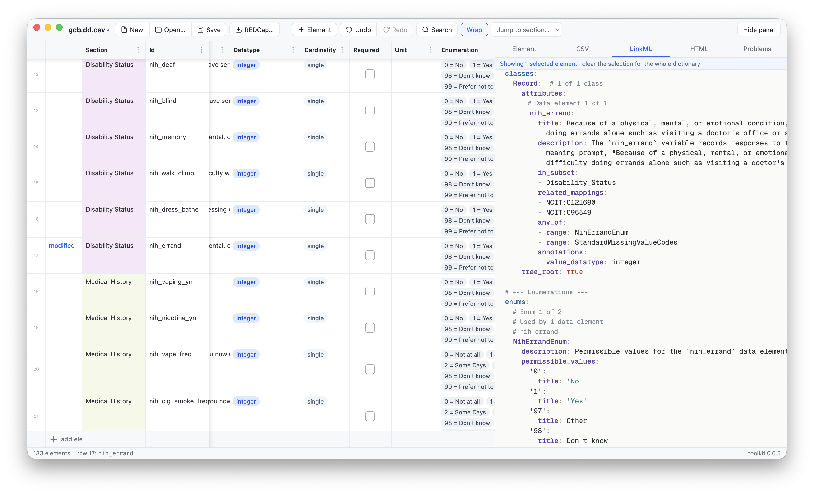

# dd-edit

A desktop app for viewing and editing
[data dictionaries](https://github.com/bmir-radx/radx-data-dictionary-specification).
A dictionary is presented as a spreadsheet — rows are data elements, columns
are the specification's fields — alongside live previews of the CSV and
[LinkML](https://linkml.io) YAML serializations and the rendered HTML page.
[REDCap](https://redcap.uits.iu.edu) data dictionary exports can be imported
directly.



## Getting the app

There are no published releases yet. Installers — a DMG for macOS, an NSIS
installer for Windows, an AppImage for Linux — can be built with
`npm run dist` (see [Packaging](#packaging)) or downloaded as artifacts of
the **Release Installers** workflow on the repository's Actions tab.
Alternatively, run from source (see [Development](#development)).

## Opening a dictionary

dd-edit opens data dictionaries saved as CSV, LinkML YAML, or dd-json — use
**Open…** (⌘O) or the buttons on the welcome screen. These are not arbitrary
formats. A CSV must follow the
[data dictionary specification](https://github.com/bmir-radx/radx-data-dictionary-specification):
one row per data element, under the specification's column headers (`Id`,
`Label`, `Datatype`, and so on). A CSV of study data, or a dictionary laid
out to some other convention, will not open. Likewise, LinkML YAML must have
the form described in [Relationship to
LinkML](#relationship-to-linkml).

REDCap data dictionary exports are the exception: they are recognized and
brought in as an import (the title shows the source, e.g.
`study.csv (imported)`), and saving writes a standard data dictionary, since
REDCap's own format cannot express everything the specification can.

## Editing in the grid

The grid works the way a spreadsheet does. Click a cell to edit it in place,
copy and paste ranges to and from Excel or Google Sheets, drag the fill
handle to repeat a value down a column, and drag rows to reorder them. Add an
element with the row at the bottom of the grid; undo and redo work for every
change (⌘Z / ⇧⌘Z); search the grid with ⌘F or the toolbar's Search button.

Two kinds of problem have a suggested correction shown directly in the cell:
a unit written informally where a standard code exists, and an enumeration
whose values are all integers while the datatype says `string`. In both
cases an amber suggestion appears in the cell; clicking it applies the
correction (datatype changes ask for confirmation first).

## The element inspector

Selecting a row shows every field of that element in the panel on the right,
where each can be edited. Several fields provide assistance:

- **Precondition** — conditions such as `consented = "1" and age >= 18` are
  written here; the field suggests what can come next as you type and shows
  a plain reading of the condition underneath.
- **Unit** — typing a unit suggests the standard [UCUM](https://ucum.org)
  code (for example "years" → `a`); free text remains allowed.
- **Enumerations and missing-value codes** — each permissible value is
  edited with its label, optionally linked to an ontology term.
- **Ontology terms** — pasting an IRI or an OBO id such as `MONDO:0004979`
  shows the term's human-readable name, with a link out to browse it.
- **Description** — written in Markdown, shown formatted.

## Previews

The CSV, LinkML, and HTML tabs show the dictionary as it will be written
out — as a table, as a LinkML schema, and as a formatted web page — and they
update as you type. Selecting rows in the grid restricts the LinkML preview
to those elements, so a single field's rendering can be inspected without
scrolling through the whole schema:



## Relationship to LinkML

[LinkML](https://linkml.io) is an open modeling language for describing the
structure of data. A schema written in LinkML can be used with the LinkML
ecosystem's tools to validate data files and to derive other artifacts from
the same source, such as JSON Schema, Pydantic models, and documentation. A
data dictionary saved from dd-edit as LinkML YAML therefore serves two
purposes: it documents the variables in a datafile, and it is a schema
against which that datafile can be validated.

The schemas that dd-edit reads and writes follow the form produced by the
[data dictionary specification's](https://github.com/bmir-radx/radx-data-dictionary-specification)
`dd-to-linkml` renderer. A single tree-root class describes the target
datafile, with one attribute per data element, in column order. Enumerations
are represented as LinkML enums whose permissible values carry the value
labels as titles; sections are represented as subsets (`in_subset`); ontology
terms as `related_mappings`. The underlying datatype of an enumerated field
is recorded in a `value_datatype` annotation, and the field's range is
expressed as an `any_of` over the field's own enum and a shared enum of
missing-value codes. dd-edit is not a general-purpose LinkML schema editor:
it reads schemas of this form, and an arbitrary LinkML schema will not open.

## Checking a dictionary

The Problems tab lists everything the specification's validator finds in the
open dictionary, and each problem highlights its cell in the grid. Line
numbers match the saved CSV line for line, so a problem reported against the
file can be traced to its row.

## Limitations

Enumerations are edited in the inspector, not yet directly in the grid, and
sections cannot yet be collapsed into groups. [DESIGN.md](DESIGN.md) has the
full roadmap.

## Development

The app is two processes: the Electron/React editor owns the document, and a
stateless Python sidecar (FastAPI, localhost) wraps the released toolkit
packages for conversion, validation, rendering, and REDCap import — see
[DESIGN.md](DESIGN.md) for the full picture. Hence two one-time setups, then
one command.

```sh
# 1. Python sidecar (on Windows, the venv's pip is .venv\Scripts\pip)
cd sidecar
python -m venv .venv && .venv/bin/pip install -e ".[test]"
cd ..

# 2. Node app
npm install

# Run (spawns the sidecar automatically, opens the window with HMR)
npm run dev
```

Sidecar tests: `cd sidecar && .venv/bin/pytest`. Renderer tests: `npm test`.
Type checks: `npm run typecheck`. CI runs all three on every push.

## Packaging

```sh
# one-time: PyInstaller into the sidecar venv
cd sidecar && .venv/bin/pip install -e ".[build]" && cd ..

npm run dist
```

`npm run dist` builds the app bundles, the PyInstaller one-dir sidecar
(`sidecar/build_binary.py`), and installers in `release/` for the platform
you are on — DMG + zip on macOS, an NSIS installer on Windows, an AppImage
on Linux. The sidecar ships inside the app as an extra resource and is
spawned from there when the app is packaged. PyInstaller does not
cross-compile, so each platform's installer must be built on that platform;
the **Release Installers** GitHub Actions workflow (run it from the Actions
tab) builds all three and uploads them as artifacts.

Builds are unsigned for now: the first launch needs right-click → Open on
macOS (Gatekeeper), or "More info" → "Run anyway" on Windows (SmartScreen).
On Linux, mark the AppImage executable first (`chmod +x dd-edit-*.AppImage`).

## License

[BSD 2-Clause](LICENSE).

## Acknowledgements

dd-edit is built with:

- [Glide Data Grid](https://github.com/glideapps/glide-data-grid) — the
  canvas-based spreadsheet grid used for the editor.
- [Electron](https://www.electronjs.org),
  [electron-vite](https://electron-vite.org),
  [electron-builder](https://www.electron.build),
  [React](https://react.dev), and [Zustand](https://zustand-demo.pmnd.rs) —
  the app shell, build tooling, and state management.
- [FastAPI](https://fastapi.tiangolo.com) and
  [Uvicorn](https://www.uvicorn.org) — the Python sidecar — bundled for
  distribution with [PyInstaller](https://pyinstaller.org).
- [LinkML](https://linkml.io) — the schema language the toolkit renders
  dictionaries into.
- [marked](https://marked.js.org) — Markdown rendering for descriptions.
- [EMBL-EBI OLS4](https://www.ebi.ac.uk/ols4/) and
  [BioPortal](https://bioportal.bioontology.org) — ontology term label
  lookups.
- [UCUM](https://ucum.org) — the unit vocabulary used for Unit field
  suggestions.
